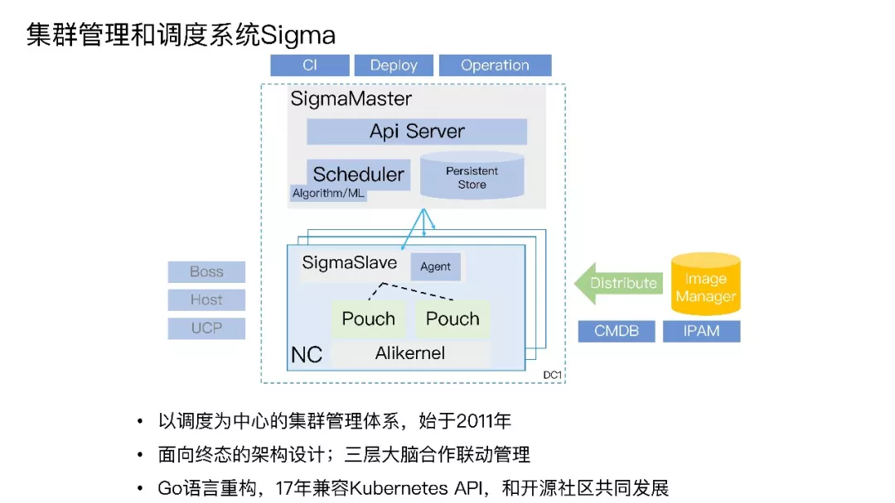
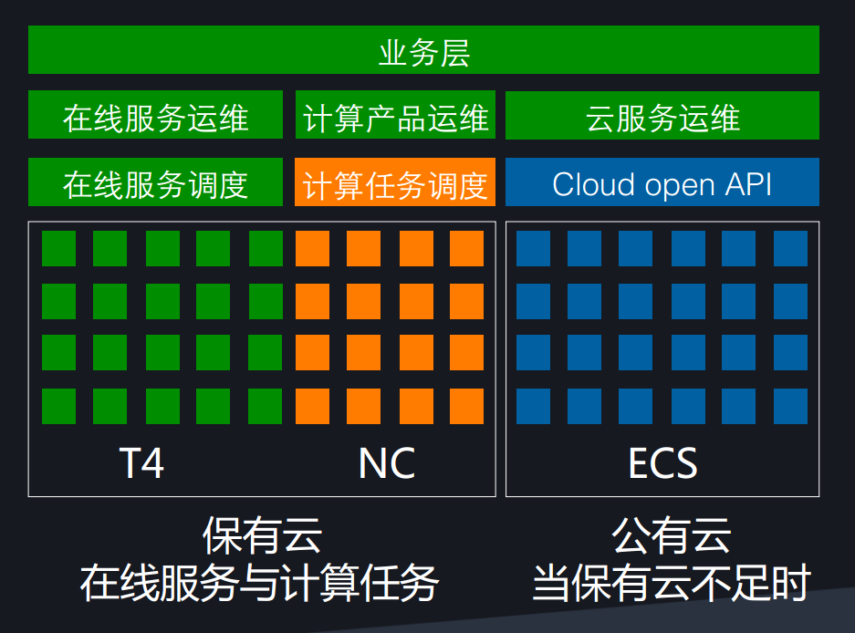
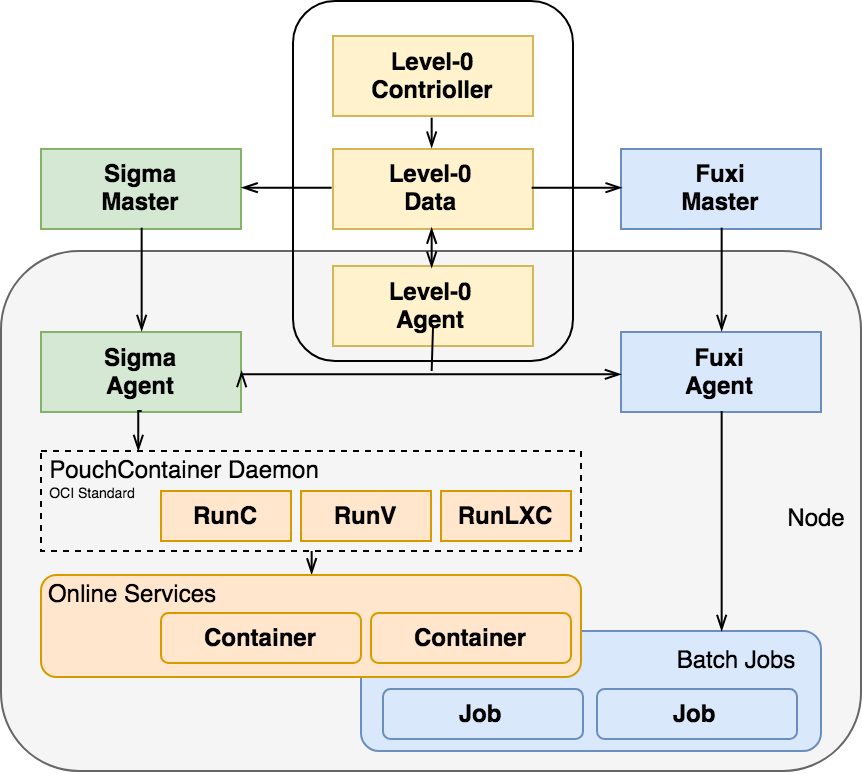
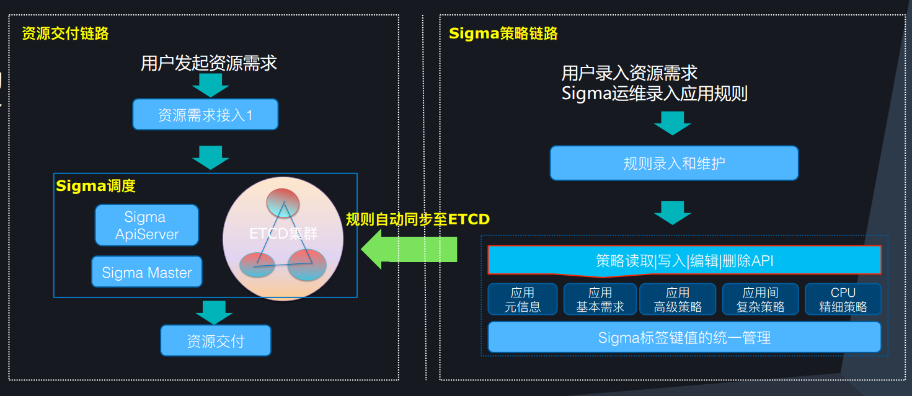
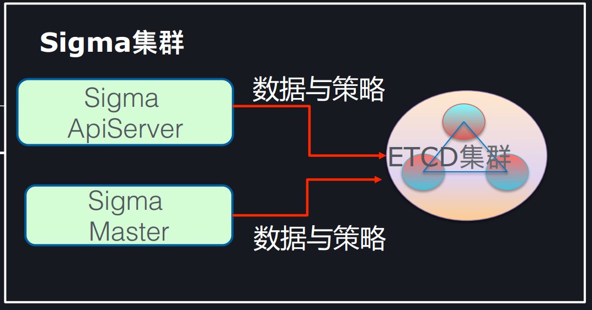
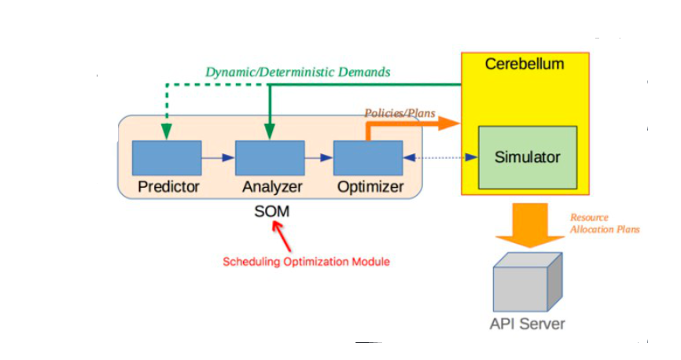
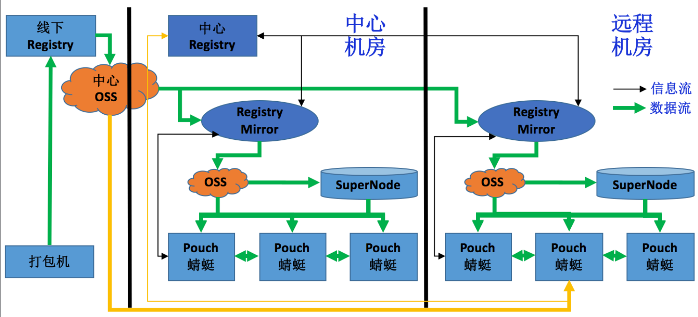
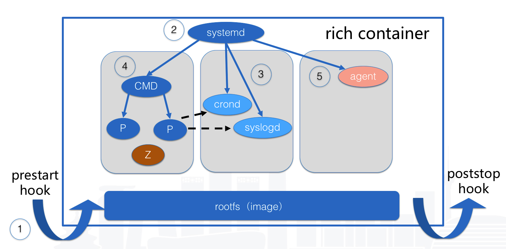
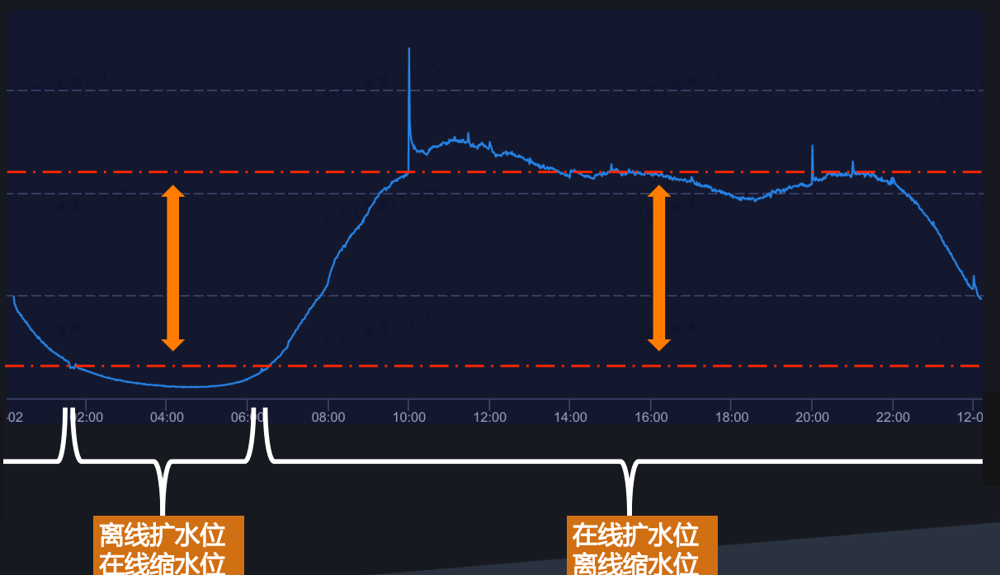

# 阿里调度与集群管理系统——基于Sigma和Fuxi

## 一、概况

资源调度管理系统是为分布式环境下大规模机器集群资源管理和调度的系统。可以提高集群管理的自动化程度和资源利用率。

### 1.业界现状

- **Google Brog:** 最早的资源调度系统，支持了谷歌大部分的产品服务以及计算任务。
- **开源框架：** Kubernetes _(from Google)_、Docker Swarm _(Docker 自己的一套调度系统)_、Yarn _(Hadoop的子项目)_
- **阿里：** Sigma和Fuxi
  
### 2.历史演进
阿里采用的调度系统经历了不同阶段的演进，从2011年开始阿里逐步开发了以sigma为核心的调度系统并在2017年大规模使用。有以下变化：

- 各部门独立的集群资源  -> 混合云 _(统一的资源池模式)_
- 离线资源与在线资源独立 -> 混布架构
- 资源使用：物理机 -> VM -> 容器
- 容器演进： T4 -> Pouch

## 二、整体架构
### 1.统一调度系统Sigma

 Sigma 有 Alikenel、SigmaSlave、SigmaMaster 三层大脑联动协作
- Alikenel 部署在每一台物理机上，对内核进行增强，在资源分配、时间片分配上进行灵活的按优先级和策略调整，对任务的时延，任务时间片的抢占、不合理抢占的驱逐都能通过上层的规则配置自行决策。
- SigmaSlave 可以在本机进行容器 CPU 分配、应急场景处理等。通过本机 Slave 对时延敏感任务的干扰快速做出决策和响应，避免因全局决策处理时间长带来的业务损失。
-  SigmaMaster 是一个最强的中心大脑，可以统揽全局，为大量物理机的容器部署进行资源调度分配和算法优化决策。
- 整个架构是面向终态的设计理念，收到请求后把数据存储到持久化存储层，调度器识别调度需求分配资源位置，Slave识别状态变化推进本地分配部署,系统整体的协调性和最终一致性非常好。

### 2.云化架构运维——混合云

- 将集群分为在线任务集群、计算任务集群和 ECS 集群。资源管理，单机运维、状况管理，命令通道、监控报警这类基础运维体系已经打通。
- 在高压力在线的场景中，在线服务调度会在云上划出一个独立的区域与其他场景互通。在互通区域，在线服务务调度可以到计算集群服务器里申请资源，生产相应容器，也可以到 cloud open API 去申请 ECS，生产出容器的资源。
- 在日常的计算场景中，计算任务调度可以到在线任务调度里申请资源，创建需要的容器，实现资源的共享，降低了资源获取成本

### 3.Sigma 与 Fuxi 混部架构

- 在线服务属于长生命周期、规则策略复杂性高、时延敏感类任务。而计算任务生命周期短、调度要求大并发高吞吐、任务有不同的优先级、对时延不敏感。
- 基于这两种调度的本质诉求的不同，阿里在混合部署的架构上把两种调度并行处理，即一台物理机上可以既有 Sigma 调度又有 Fuxi 调度，实现基础环境统一，通过不同调度间的协调提高资源利用率。

## 三、关键技术

### 1. 灵活配置调度

- Sigma中所有的调度策略都可配置
  

- 用户录入资源需求后Sigma直接通过策略编辑API同步到 ETCD集群中统一管理。当用户再次发起请求时，Sigma 调度系统即从ETCD集群中读取
  

- 同时Sigma ApiServer 和 Sigma Master 也会将自身调度数据上传到ETCD，依靠ETCD的高可用以及优化保持系统的一致性。
  
  ### 

 2. 资源隔离

- 为了支持大规模的资源集成以及高效的计算资源混部，阿里实施了多层次的内核资源隔离。
    - 在 CPU HT 资源隔离上，做了 Noise Clean 内核特性，解决在 / 离线超线程资源争抢问题。
    - 在 CPU 调度隔离上，CFS 基础上增加 Task Preempt 特性，提高在线任务调度优先级。
    - 在 CPU 缓存隔离上，通过 CAT，实现在、离线三级缓存 (LLC) 通道隔离 (Broadwell 及以上)。
    - 在内存隔离上，拥有 CGroup 隔离 /OOM 优先级；Bandwidth Control 减少离线配额实现带宽隔离。
    - 在内存弹性上，在内存不增加的情况下，提高混部效果，在线闲置时离线突破 memcg limit；需要内存时，离线及时释放。
    - 在网络 QoS 隔离上，管控打标为金牌、在线打标为银牌、离线打标为铜牌，分级保障带宽。

### 3. 应用画像与服务模拟

- 为了准确的进行调度优化，调度系统对应用的内存、CPU、网络、磁盘和网络 I/O 容量进行画像。了解具体业务应用的特征、资源规格需求，不同的时间对资源真实使用情况。同时综合亲和互斥和任务优先级的分配 _(也即哪种应用放在一起使整体计算能力比较少、吞吐能力比较高)_ 等因素进行整体的调度优化。
- 同时，阿里还开发了服务模拟器。通过模拟器和线上数据回放，对批量建站请求进行仿真模拟，并优化方案。

### 4.  Pouch容器化
- 阿里在原有自研容器T4基础上，吸收了docker镜像机制等优点，开发完成了Pouch，并在17年完成所有应用的pouch化。
- Pouch作为在阿里内部接受过大规模、高压力考验过的容器有许多优势：
    -  **隔离性:** 相较于传统的容器：Pouch扩展了资源隔离的维度并支持了多个虚拟化标准。详见 [资源隔离](#1)
    - **p2p镜像分发:** 采用了P2P的镜像分发模式，相较docker提升了镜像传输速率，使得大规模的镜像部署速度大幅提升。
  
    - **富容器:** 富容器为IT人员提供了有效路径，帮助业务在单个容器镜像中除了业务应用同时打包所需的运维套件和系统服务，能够快速的兼容企业原有运维体系。这样应用可以在不改变任何业务代码和运维代码来在容器中运行，大大缩减了业务容器化的流程。换言之，富容器在保障业务交付效率的同时，在开发和运维层面对应用没有任何的侵入性.
     

## 四、存在的问题

### 1.混部利用率

- 混部的架构模式确实可以提高整个调度系统的弹性，提高资源利用率。但是，在低水位的情况下，离线资源和在线资源协调式的独立调度可能会导致离在线资源分配不符合实际压力情况，导致资源利用率不高。
- 阿里介绍说，调度系统有加入分时复用,在在线服务压力较小的时段对在线服务缩容，离线资源扩容。但仍是根据时间进行的扩缩容操作，没有明确的容量预测的机制。
   

### 2.优先级策略

- 目前的混部架构中，并没有明确的优先级差异，资源申请优先级依靠策略进行配置，只能协调在线任务和离线任务的优先级。更详细的优先级差异并无法体现。因此对于一些重要的离线任务的资源需求可能无法满足。
  
## 四、总结

- 可以看到阿里作为国内云计算领域的领先企业，在调度系统领域拥有非常深厚的技术积累。同时，在阿里大规模的大量业务的锤炼下，整套调度系统也在不断完善，其能力毫无疑问已经是世界领先水平。
- 当然，这个系统中还有一些地方不甚完美,希望阿里在未来能够将整套系统打磨完美。除此之外，阿里自身也提到了在未来的调度系统中将支持更大规模的混部，扩展支持到包括GPU以及FPGA的异步计算，同时也会加入算法驱动以及智能决策来提升系统的效率，让我们拭目以待。

----------------------

## 参考文献
- [1] [丁宇 .  阿里巴巴云化架构创新之路](https://bj2017.archsummit.com/presentation/285)
- [2] [侯前明 . Pouch和阿里容器技术演进](https://bj2017.archsummit.com/presentation/313)
- [3] [吕奇 . 阿里混部技术最佳实践](http://chuansong.me/n/2035187)
- [4] [张瓅玶 .阿里巴巴调度与集群管理系统Sigma](http://chuansong.me/n/2035187)