# Borg, a Large-scale Cluster Management System[1]

----
## 一、基础架构

### 1.系统结构
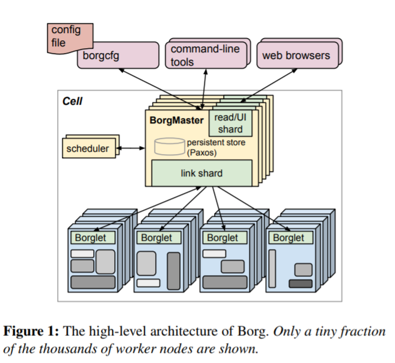

Borg 由三个最主要的部分组成，一是外部管理工具和配置文件，二是中央控制器BorgMaster，三是每个机器上的Borglet。。

- 外部管理工具和配置文件
    - 包括一些命令行工具、声明式配置文件、BorgMaster的模拟器Fauxmaster等。
    - 能够向Borg发送新的任务、更新任务状态、协助debug。
- BorgMaster
    - 由两个进程组成，分别为主BorgMaster进程和一个分离的调度器。
    - 逻辑上是一个单一进程，但实际有五个重复单元，每个重复单元维护一个cell在内存中的大部分状态。
    - 在一个给定时间点里，会将定期快照保存在Paxos store中。
    - 内部包含一个link shard用来与Borglet交互。
    - 采用轮询的方式获取机器信息。
- Borglet
    - 出现在cell的每一台机器中，实质是一个本地的Borg代理。
    - 能够控制task，并自动重启以及管理本地资源和向BorgMaster报告状态。
  
### 2.workload

- 需要长期运行，处理短暂且对延迟敏感的任务，这类任务被称为production, 简写为`prod`。
- 需要几秒到几天来完成的批处理任务，对短时间的性能波动不敏感，这类人物被称为non-production，简写为`non-prod`。

### 3.资源层次

- 许多台machine被聚合为一个cell。
- 一个cluster通常包含一个大的cell，有时会因为需要而添加一些小的cell。
- 一个cluster被放在单个data center中。
- 多个data center构成一个site。

## 二、工作特点

### 1.可扩展性
- 一个Borgmaster可以管理一个cell中的数千台机器，并且几个cell具有每分钟超过10000个任务的到达速率。
- 为降低响应时间，使用单独线程与Borglet通信并响应只读RPC，为了更好地性能，在Borgmaster的五个副本中分割这些功能。
- 使用以下技术使Borg调度器更具可拓展性：
    - 分数缓存：缓存一个机器的分数，直到机器或任务的属性改变，并忽视资源数量的变化除非其超过阈值。
    - 等价类：对一类等价类的一个任务进行可行性分析和评分，并依此分配这一组任务。
    - 松散随机化：通过随机顺序检查机器，知道找到足够可行的机器评分，然后选择该集合中的最佳机器。
  
在实验中，调度编排一个cell的全部工作负载通常需要几百秒，但是禁用上述技术后超过三天还没有完成。通常在等待队列上的在线调度产地在不到半秒内完成。

### 2.可用性
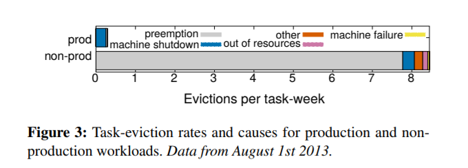

上图展示了几种任务被逐出的原因

  ----
Borg通过以下措施来减轻这些事件的影响：
- 如果有必要就自动重新调度被逐出的任务。
- 通过在机器、机架、电源域之间分散任务，减少关联故障。
- 限制在维护活动中可以被同时关闭的任务的任务中断的允许速率和任务数量。
- 使用声明式期望状态表达和幂等操作，使得失败的客户端可以无损害地重新。提交任何被遗忘的请求避免。
- 拒绝重复的引起任务或机器崩溃的任务-机器配对。
- 通过不断重新运行日志记录器任务来恢复写入本地磁盘的关键中间数据。

Borg的一个关键设计是，计时Borgmaster或任务Borglet关闭，已经运行的任务也会继续运行。

### 3.利用率
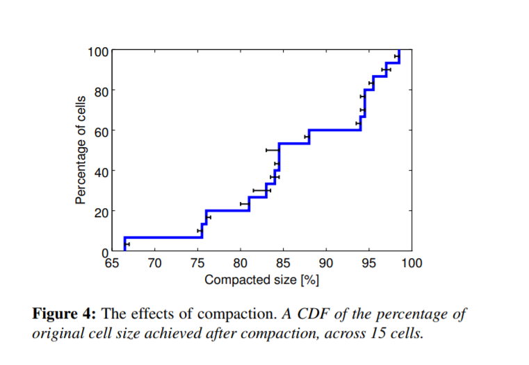
- Borg采用一种叫做*cell compaction*的方法对利用率进行评估，这一方法旨在测定一个job在不同的策略下需求的cell大小，以此来比较不同策略对利用率的影响
----
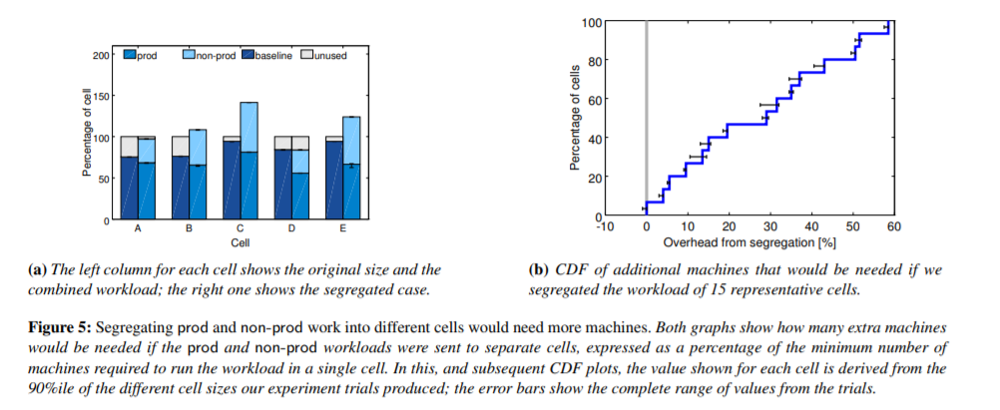

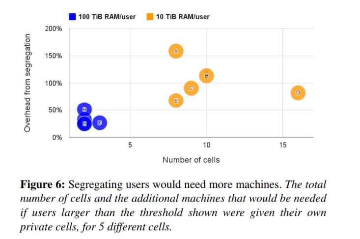
- 将`prod`和`non-prod`任务编排在同一cell，使`prod`与`non-prod`互补从而减少机器使用的突然峰值和空闲。
----
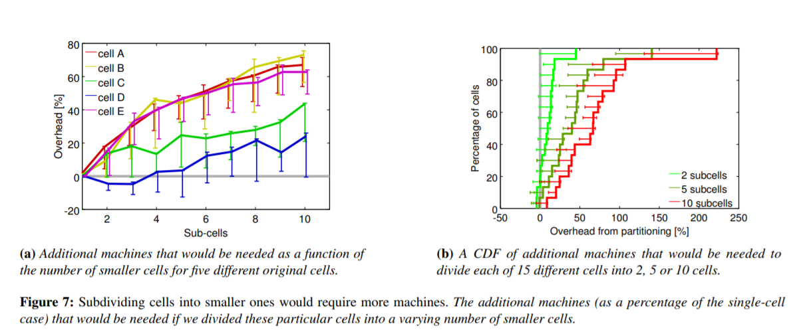
- 构建更大的cell，使得能够容纳更多服务，并彼此消去资源的波动。
----
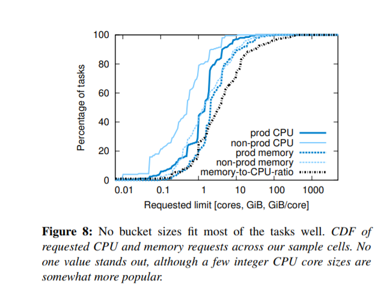
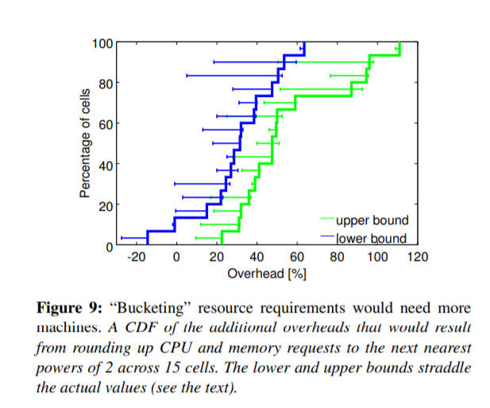
- 细粒度资源请求，而非使用传统的以二的幂为bocket的资源划分。
----
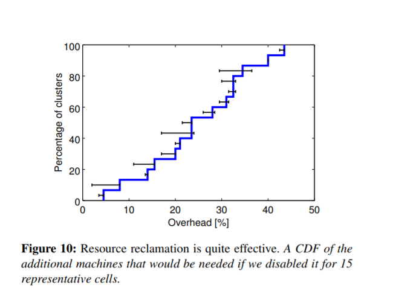
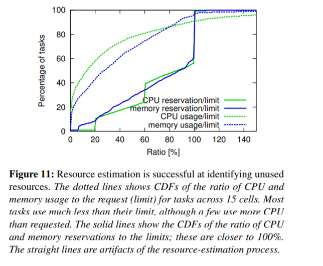
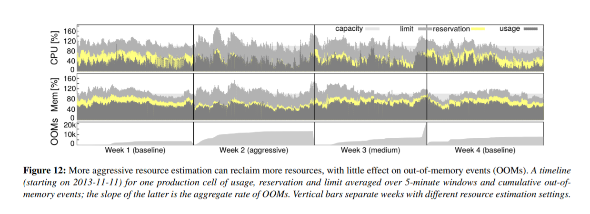

- 资源回收，Borg估计任务将要使用的资源，并回收可以使得`non-prod`工作的资源。
----
  
### 4.隔离

- 通过ssh秘钥、chroot、cgroup来实现对机器的安全隔离。
- 使用基于Linux cgroup的资源容器运行任务，Borglet操作容器设置。
- 为了帮助过载与过量使用，Borg优先使得延迟敏感型任务得到处理，虽然这可能导致某些批处理任务暂时停止几秒。
- 为了提高性能隔离，延迟敏感型任务可以保留整个物理CPU核，依此保证CPU高速缓存不被污染。
- 按照优先级杀死任务以保证足够的不可压缩资源剩余，限制使用可压缩资源以保证延迟敏感型任务可以处理短负载高峰。

## 三、相关工作

- Apache Mesos使用基于供应的机制在重要资源管理器和多个“框架”之间花粉资源管理和放置功能。[2]
- YARN是一个以Hadooop为中心的集群管理器，每个应用程序都有一个管理器，它与中央资源管理器协商所需的资源。[3]
- Facebook的Tupperware是一个类似Borg的系统，用于在集群上调度cgroup容器。[4]
- Microsoft的Autopilot系统提供自动化软件配置和部署、系统监控、执行修复动作来处理软件和硬件故障。[5]
- Quincy使用网络流模型为几百个节点的集群上的数据处理DAG提供公平性和数据位置感知调度。[6]
- Cosmos专注于批处理，重点是确保其用户能够公平地方位他们捐赠给集群的资源。[7]
微软的Apollo系统[13]使用每个作业调度器进行短期批处理作业，以在看来与Borg cell大小相同的集群上实现高吞吐量。[8]
- 阿里巴巴的Fuxi支持数据分析工作负载，它从2009年开始运行。
Omega [69]支持多个平行的，专门的“垂直”，每个大致相当于Borgmaster减去其持久存储和链接分片。[9]
- Google的开源Kubernetes系统将应用程序放置在容器中，运行在逻辑或者各种云托管提供者中。[10]

## 四、经验与教训
###  教训
- 不应该设置job来限制组织任务的方法。这限制了诸如滚动更新、天正作业大小的不灵活问题。
- 给每个机器一个IP使得问题变得复杂，Borg必须调度端口作为资源，任务需要声明自己需求的端口资源、Borglet必须强制端口隔离，命名系统和RPC需要处理端口和IP地址。
- Borg针对高级用户进行优化，并提供了一系列特权用户的功能，这使得一切对其他用户更难。
### 经验
- Allocs是有用的。
- 集群管理系统不只是一个任务管理系统。运行在Borg上的应用程序可以从许多其他集群服务中收益。
- 内省是至关重要的。Borg的一个重要设计决策是要向所有用户显示调试信息，而不是隐藏。
- master是分布式系统的内核，这样可以使得在不牺牲性能和可维护性的情况下拓展工作负载和功能集。

## 五、参考文献
- [1] [Large-scale cluster management at Google with Borg. ](https://storage.googleapis.com/pub-tools-public-publication-data/pdf/43438.pdf)
- [2] B. Hindman, A. Konwinski, M. Zaharia, A. Ghodsi, A. Joseph, R. Katz, S. Shenker, and I. Stoica. Mesos: a platform for fine-grained resource sharing in the data center. In Proc. USENIX Symp. on Networked Systems Design and Implementation (NSDI), 2011.
- [3] V. K. Vavilapalli, A. C. Murthy, C. Douglas, S. Agarwal, M. Konar, R. Evans, T. Graves, J. Lowe, H. Shah, S. Seth, B. Saha, C. Curino, O. O’Malley, S. Radia, B. Reed, and E. Baldeschwieler. Apache Hadoop YARN: Yet Another Resource Negotiator. In Proc. ACM Symp. on Cloud Computing (SoCC), Santa Clara, CA, USA, 2013 
- [4] [A. Narayanan. Tupperware: containerized deployment at Facebook. June 2014.](http://www.slideshare.net/dotCloud/upperware-containerized-deployment-at-facebook)
- [5] M. Isard, V. Prabhakaran, J. Currey, U. Wieder, K. Talwar, and A. Goldberg. Quincy: fair scheduling for distributed computing clusters. In Proc. ACM Symp. on Operating Systems Principles (SOSP), 2009.
- [6] [P. Helland. Cosmos: big data and big challenges. 2011.](http://research.microsoft.com/en-us/events/fs2011/helland\_cosmos\_big\_data\_and\_big\_challenges.pdf)
- [7] E. Boutin, J. Ekanayake, W. Lin, B. Shi, J. Zhou, Z. Qian, M. Wu, and L. Zhou. Apollo: scalable and coordinated scheduling for cloud-scale computing. In Proc. USENIX Symp. on Operating Systems Design and Implementation (OSDI), Oct. 2014.
- [8] Z. Zhang, C. Li, Y. Tao, R. Yang, H. Tang, and J. Xu. Fuxi: a fault-tolerant resource management and job scheduling system at internet scale. In Proc. Int’l Conf. on Very Large Data Bases (VLDB), pages 1393–1404. VLDB Endowment Inc., Sept. 2014.
- [9] M. Schwarzkopf, A. Konwinski, M. Abd-El-Malek, and J. Wilkes. Omega: flexible, scalable schedulers for large compute clusters. In Proc. European Conf. on Computer Systems (EuroSys), Prague, Czech Republic, 2013.
- [10] [Kubernetes. Aug. 2014.](http://kubernetes.io)