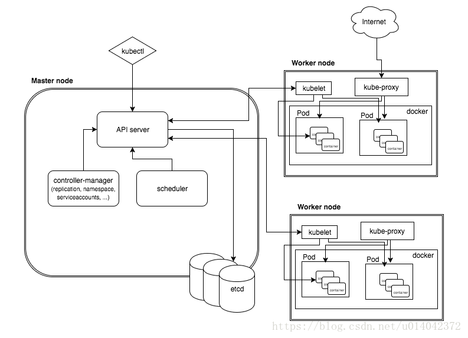
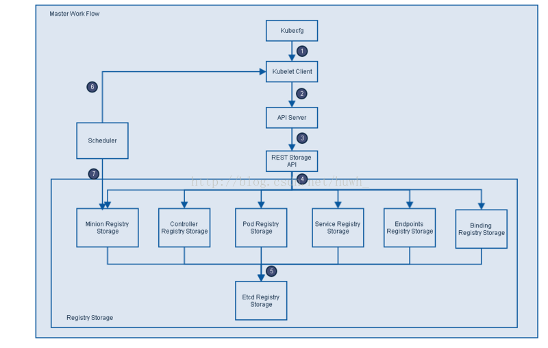

# Production-Grade Container Orchestration

----
## 一、基础架构

### 1.整体架构

Kubernetes属于主从分布式架构，主要由Master Node与Worker Node组成，同时还包括如客户端命令行工具kubectl以及其他附加项。
- Master Node
    - 作为控制节点，主要对集群的任务做调度管理。
    - API server 用来处理REST的操作，并确保他们生效、执行相关业务逻辑以及更新etcd中的相关对象。另外API Server也作为集群网关。
    - Cluster State Store。kubernetes默认使用etcd作为集群整体存贮。etcd是一个简单的、分布式的、一致的key-value存储，主要用来分享配置和服务发现。
    - Controller-Manager Server用于执行大部分集群层次功能，它既执行生命周期功能，也执行API业务逻辑。
    - Scheduler用于为容器选择运行的主机。依据请求资源的可用性，服务请求的质量等约束条件，scheduler监控未绑定的pod，并将其绑定至特定的node节点。
- Worker Node
    - 作为主要的工作节点，用来运行各种业务应用的容器。
    - Kubelet是kubernetes中最主要的控制前，也是Pod和Node API的主要实现者，Kubelet负责驱动容器执行层。
    - Container Runtime负责下载镜像和运行镜像。Kubernetes不提供容器环境，但提供接口。
    - Kube proxy负责为pod创建代理服务，实现服务到pod的路由和转发，以及通过应用的负载均衡。
- Kubectl：kubernetes集群的命令行接口。
- 附加项和其他依赖
    - 网络和网络策略
    - 服务发现
    - 可视化与控制

### 2.主要结构
- Pods：
    - 最小部署单元，可包含多个容器，把容器组合并共享文件卷。
    - 它们是最小的部署单元，由 Kubernetes 统一创建、调度、管理。
    - Pods是可以直接创建的，但推荐的做法是使用 Replication Controller，即使是创建一个 Pod。
- Labels： 
    - Label以key/value形式附加到Pos、Service、RC、Node等上    面。
    - 每个对象可以定义多个label，以提供Label Selector来选择对象， Label Selector有两种形式：
        - 基于等式，`name=redis-slave`选择k/v都相等的，`env!=productio`n选择k=env但是v!=production的
        - 基于集合，`name [not] in (redis-master,redis-slave)`，类似于SQL中in
- Service
    - Service是定义一系列Pod以及访问这些Pod的策略的一层抽象。

### 3.工作流程

## 二、工作特点

### 1、POD
- pod在kubernetes中是一个拥有独立ip的开发单元。
- pod是一个短暂的实体，与Borg中的`alloc`类似，是一个或多个容器的资源封装，但与`alloc`不同的是，每个pod都拥有一个`IP`。

### 2、副本控制器
- 副本控制器保证期望数量的容器在任何一个给定时间被启动并运行。
- 可以自动回复并维持pod在一个被指定的状态。

### 3、水平自动扩容
- 允许基于负载自动扩容计算资源。
- kubernetes的pod自动使用`HorizontalPodAutoscaler`对象，以此以从Heapster中获得的指标数据来自动增减pod的数量。
  
### 4、服务发现
- 用于副本控制器和水平自动扩容会在任何`node`上动态创建pod，所以服务需要动态地获得`I`P和`port`来在集群中通讯。
- Kubernetes使用DNS的方法来跟踪集群中每个新服务，并为他们创建DNS记录。

### 5、网络
- 为了充分管理集群，需要适当地设置网络，kubernetes提供了三种网络模式来解决这个问题。
- 容器与容器通讯：pods通过`namespace`和本地通讯解决这个问题。
- pod与pod通讯：这个问题通过软件定义的网络来解决。
- 外部到pod通讯：这点由Service解决。

### 6、Label
- label用来描述pod的属性。
- label是attach到pod的一对key/value。
- kubernetes通过label来更加灵活的组织服务之间的关系、编排服务到不同的节点。

### 7、Service
- Service是定义一系列Pod以及访问这些Pod的策略的一层抽象。
- Service通过Label找到Pod组，然后通过负载均衡进行分发。

## 三、总结
- kubernetes和Borg以及Omega一样，都是谷歌开发的容器管理系统，但kubernetes吸收了Borg的一些教训，并在架构方面做了更新。
- 编排只是开始，不是结束，还需要提供许多服务来提高基本的容器管理服务，比如：命名和服务发现、面向应用的负载均衡、横向和纵向的自动扩容、发布工具、检测工具、日志系统等等。
- kubernetes中每个pod拥有一个ip而不像Borg将port也作为资源的一部分进行调度，这样的方法明显降低了复杂度，并且使得可以使用传统的DNS服务来代替以往很复杂的服务发现方式。
- 为容器提供标签是很好的方式，Borg采用Job的方式管理任务，这样的组织方式显得太过僵硬，无法支持跨越集群的Job，而用于Job的内部实现方式，对每个任务仅仅赋予一个编号，这样使得无法自动更新、也无法简单的关闭或重启所有的服务。

参考资料：
- [kubernetes-整体概述和架构](https://blog.csdn.net/u014042372/article/details/80573213)
- [kubernetes基本框架和基本概念](https://www.jianshu.com/p/0a656b3d94b2)
- [Kubernetes: Twelve Key Features](https://medium.com/@abhaydiwan/kubernetes-introduction-and-twelve-key-features-cdfe8a1f2d21)
- [Borg, Omega, and kubernetes, lessons learned from three container-management systems over a decade](https://storage.googleapis.com/pub-tools-public-publication-data/pdf/44843.pdf)
