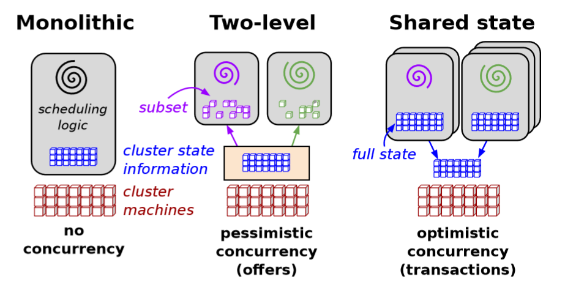
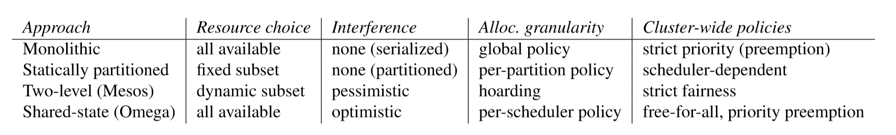

# Omega: flexible, scalable schedulers for large compute clusters[1]

## 一、基础

### 1. 三种集群资源调度架构[2]

- 中央式(Monolithic)
    中央式调度器实质上就是一个单一的调度agent来负责所有请求。由于将资源的调度和作业的管理功能全部放到一个进程中完成，扩展性较差。

- 双层式(Two-level)
    双层调度器采用“分层”思想，上层是一个非常轻量级的的中央式调度器，下层是具体某个应用程序的调度器。这样就可以减小“中心节点”的压力，由原来的一个“中心”，变成二层“中心”；而且同一个集群中多种应用接入，多种框架混部，有效提高分布式集群的利用率。但是，这种“二级调度”也有缺陷：各应用无法感知集群整体的使用状况，只能等待上层调度推送信息；再加上资源分配采用轮询，在分配过程使用“悲观锁”（即`PCC`，Pessimistic Concurrency Control，悲观并发访问控制方式），并发粒度小，响应稍慢，缺乏一种有效的竞争机制。

- 共享状态式(shared-state)
    这种调度器将双层调度器中的集中式资源调度模块简化为持久化的“共享数据”（状态）和针对这些数据的验证代码——这里的“共享数据”实际上就是整个集群的实时资源使用信息。其资源申请采用“乐观锁”（即`MVCC`，Multi-Version Concurrency Control，多版本并发访问控制方式），优先级控制，大大提升并发性。

### 2. workload介绍

- batch workload
    批量任务，优先级低，或者用于调优。一般会快速运行，执行一定的计算任务，然后终止。

- service workload
    运行供用户使用的jobs，或运行一些基础模块，它们一般会长期运行。

- 对比
    在一个cluster中会混杂着batch jobs和service jobs，一般batch jobs的jobs和tasks的数目会远远大于service jobs，但对资源的占用率却和service jobs差不多，甚至更低。

## 二、待解决的问题

1. 如何高效地分配资源？用十多秒分配一个service jobs是合理的，毕竟这个类型的job会运行很久，但十多秒来分配一个batch job显然不合理
2. 在调度任务时如何划分任务类别？是忽略workload type，还是使用专门为某种workload设计的调度器，还是兼而有之？
3. 调度任务时如何选择资源？是允许在所有的cluster里面选，还是在一个子集里面选以减少做决定的时间？允不允许挤(preempt)占任务？
4. 如果两个任务同时申请同一资源，要怎么办？是像双层式架构那样使用`PCC`使得在同一时间资源只对一个任务可见，还是像共享状态式架构那样使用`MVCC`利用优先级动态调度？
5. 一个job由许多task组成，如何控制分配资源的粒度？是以job为单位(all-or-nothing)，还是以task为单位(incremental placement)？
6. 有些系统行为同时依赖多个调度器，如何做好协调工作？

## 三、工作特点

1. 采用共享状态式的架构，赋予每个调度器访问整个cluster的权限，因此不存在中央管理器（Borg/k8s中的master）

2. 采用`MVCC`：双层调度器使用的`PCC`的主要缺点是并发粒度小，因为在任意一个时刻，中央资源调度器只会将所有资源推送给任意一个调度器，等到这个调度器返回资源使用情况后，才能将资源推送给其他调度器，这大大限制了系统并发性。`Omega`使用的`MVCC`，将集群状态数据持久化，并共享给所有调度器。这样所有的调度器可以并行工作，而影响该机制性能的一个因素是资源访问冲突的次数，冲突次数越多，系统性能下降得越快，而论文中的实验表明，这种方式的冲突次数是可以接受的

3. 调度由支持并发的子调度器完成，这些子调度器由各个应用程序自我管理和控制，`Omega`只是将优先级这一限制放在了共享数据的验证代码中，即当同时有多个应用程序申请同一份资源时，优先级最高的那个将获得该资源，其他资源限制全部下放到各个子调度器

4. `Omega`采用`all-or-nothing`的资源分配方式。`all-or-nothing`可能会造成作业饿死（大资源需求的任务永远得到不需要的资源），而`incremental placement`会造成资源长时间闲置，同时可也能导致作业饿死

## 四、对比

## 五、疑问 

1. 整体架构是什么样的？

2. 子调度器如何保证fairness？

3. 从调度架构的演变史来看，将来会不会出现全分布式的架构？

----------------------

## 参考文献
- [1] [Omega: flexible, scalable schedulers for large compute clusters](http://static.googleusercontent.com/media/research.google.com/zh-CN//pubs/archive/41684.pdf)
- [2] [十大主流集群调度系统大盘点](https://blog.csdn.net/vip_iter/article/details/80123228)

