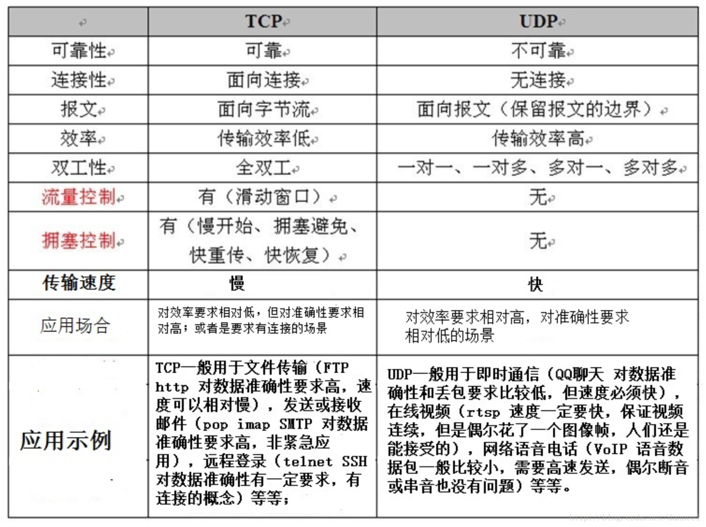
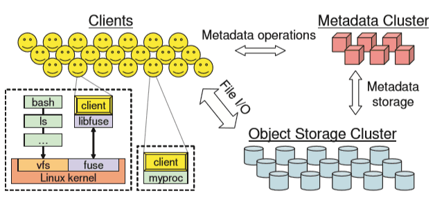
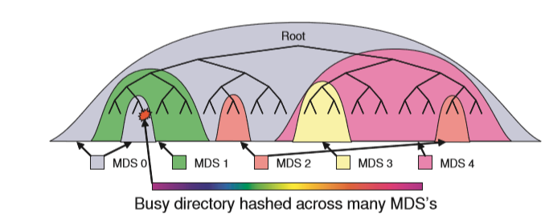

# Network

## 【物理层】同轴电缆 VS. 双绞线 VS. 光缆 VS.无线介质

### 概要介绍

- #### 同轴电缆：

  > ​	同轴电缆是由一层层的绝缘线包裹着中央铜导体的电缆线，它的最大特点就是抗干扰能力好，传输数据稳定，而且价格也便宜，所以一度被广泛使用，如闭路电视线等。

  **优势:** 价格便宜、抗干扰能力好

  **劣势:** 传输速率慢、维护困难*(单条电缆的损坏可能导致整个网络瘫痪)*。

- #### 双绞线：

  > ​	双绞线是一种柔性的通信电缆，包含着成对的绝缘铜线，它的特点是价格便宜，所以被广泛应用，如我们常见的电话线等。根据最大传输速率的不同，双绞线可分为3类、5类及超5类。3类双绞线的速率为10mb/s，5类可达100mb/s，而超5类则高达155mb/s以上。双绞线还可分为屏蔽双绞线（stp）和非屏蔽双绞线（utp）。stp双绞线虽然速率较低（只有4mb/s），但抗干扰性比utp双绞线强。

  **优势：** 价格便宜，应用广泛	

  **劣势：** 传输速率受限，抗干扰性差，传输距离较短

- #### 光缆：

  > ​	光纤光缆是新一代的传输介质，与铜质介质相比，光纤无论是在安全性、可靠性还是网络性能方面都有了很大的提高。除此之外，光纤传输的带宽大大超出铜质线缆，而且其支持的最大连接距离达两公里以上，是组建较大规模网络的必然选择。由于光纤光缆具有抗电磁干扰性好、保密性强、速度快、传输容量大等优点。目前比较常见的有两种不同类型的光纤，分别是单模光纤和多模光纤（所谓"模"就是指以一定的角度进入光纤的一束光线）。多模光纤一般被用于同一办公楼或距离相对较近的区域内的网络连接。而单模光纤传递数据的质量更高，传输距离更长，通常被用来连接办公楼之间或地理分散更广的网络。

  **优势：** 速度快，保密性强，抗干扰性好，传输距离长

  **劣势：** 价格贵，需要专门的收发设备

- #### 无线介质：

  > ​	无线网络（wireless network）是采用无线通信技术实现的网络。无线网络既包括允许用户建立远距离无线连接的全球语音和数据网络，也包括为近距离无线连接进行优化的红外线技术及射频技术，主流应用的无线网络分为通过公众移动通信网实现的无线网络（如4G，3G或GPRS）和无线局域网（WiFi）两种方式。

  **优势：** 连接便捷，维护方便

  **劣势:** 抗干扰性差，传输距离受限，组网成本较高

### 指标对比

|              | 介质       |          传输速度          | 最大传输距离  |    成本    |
| ------------ | :--------- | :------------------------: | ------------- | :--------: |
| **同轴电缆** | 铜（电）   |        2～20M bps。        | 185-500米     |  1-3元/米  |
| **双绞线**   | 铜（电）   | 10(3类线)~155Mbps（超5类） | 100米         | 0.8-8元/米 |
| **光缆**     | 玻璃（光） |          1~40Gbps          | 100米~400千米 |  2-8元/米  |
| **无线介质** | 微波、红外 |       50Mbps~10Gbps        | 50米~2千米    |     -      |
### 选择建议

- 长距离网络布线：光缆
- 室内网络布线：双绞线、无线网络
- 高带宽要求：光缆

## 【数据链路层】网卡

### 概要介绍

> ​	网卡是工作在链路层的网络组件，是局域网中连接计算机和传输介质的接口，不仅能实现与局域网传输介质之间的物理连接和电信号匹配，还涉及帧的发送与接收、帧的封装与拆封、介质访问控制、数据的编码与解码以及数据缓存的功能等。

​	网卡的主要功能有：数据的封装与解封，链路管理以及编码译码。

​	随着网络的发展，网卡也发展出许多不同的种类和类型：

1. **按适用计算机种类：** 分为标准以太网卡和PCMCIA网卡，其中PCMCIA是用于笔记本电脑的网卡。
2. **按适用传播介质：** 分为普通网卡和光纤网卡，光纤一般通过光纤线缆与光纤以太网交换机连接。
3. **按传播速率：** 分为10Mbps网卡、100Mbps网卡、10/100Mbps自适应网卡和1000Mbps网卡，至于光纤网卡可达到10Gbps。
4. **按支持总线类型：** 主要可以分为ISA、EISA、PCI等。

### 评价指标

1. **传输速率**：这是最直接的评价指标，一般会选取传输速率符合自己要求的网卡。
2. **芯片性能：** 网卡工作涉及到大量的包处理，一个高效能的芯片能快速计算流经网卡的数据，从而减轻CPU的负担。
3. **总线类型：** 总线类型决定了I/O的快慢，总线类型要与自己的主板相匹配，一般来讲PCI总线的网卡速率较快，而PCI-X总线的网卡相较PCI又有提升。

## 【数据链路层&网络层】交换机VS.路由器

### 概要介绍

​	很多人分不清交换机和路由器的，交换机和路由器分别工作在数据链路层和网络层，是功能不同的网络设备。

|          |           交换机           |               路由器               |
| -------- | :------------------------: | :--------------------------------: |
| 工作层次 |         数据链路层         |               网络层               |
| 寻址方式 |      根据设备MAC地址       |               IP地址               |
| 速度     |             快             |                 慢                 |
| 广播域   | 数据包在所有相连网段上传播 | 可以分割广播域，各个广播域不能交流 |

- #### 交换机：

  > ​	交换（switching）是按照通信两端传输信息的需要，用人工或设备自动完成的方法，把要传输的信息送到符合要求的相应路由上的技术的统称。交换机根据工作位置的不同，可以分为广域网交换机和局域网交换机。广域的交换机（switch）就是一种在通信系统中完成信息交换功能的设备，它应用在数据链路层。交换机有多个端口，每个端口都具有桥接功能，可以连接一个局域网或一台高性能服务器或工作站。交换机工作于OSI参考模型的第二层，即数据链路层。交换机内部的CPU会在每个端口成功连接时，通过将MAC地址和端口对应，形成一张MAC表。在今后的通讯中，发往该MAC地址的数据包将仅送往其对应的端口，而不是所有的端口。因此，交换机可用于划分数据链路层广播，即冲突域；但它不能划分网络层广播，即广播域。

  **主要功能：** 完成同一子网段内数据的快速传输，主流的交换机端口速率为100Mbps,光纤交换机最高可达100Gbps

  **主要供应商：** 华为以及思科（Cisco）

- #### 路由器：

  > ​	路由器（Router），是连接因特网中各局域网、广域网的设备，它会根据信道的情况自动选择和设定路由，以最佳路径，按前后顺序发送信号。路由器是互联网的主要结点设备。路由器通过路由决定数据的转发。转发策略称为路由选择（routing），这也是路由器名称的由来（router，转发者）。作为不同网络之间互相连接的枢纽，路由器系统构成了基于TCP/IP 的国际互联网络Internet 的主体脉络，也可以说，路由器构成了Internet的骨架。它的处理速度是网络通信的主要瓶颈之一，它的可靠性则直接影响着网络互连的质量

  **主要功能**：路由器的功能更多的体现在不同类型网络之间的互联上，如局域网与广域网之间的连接、不同协议的网络之间的连接等，所以路由器主要是用于不同类型的网络之间。它最主要的功能就是路由转发，解决好各种复杂路由路径网络的连接就是它的最终目的。相较于交互机，路由器转发速度较慢，主流路由器的端口速率在百兆左右，最高可以达到8Gbps。

  **主要设备供应商**：H3C、华为、TP-LINK

### 评价指标

- #### 交换机：

  - **背板带宽**：  背板是交换机输入端和输出端之间的物理通道。背板带宽越宽，交换机数据处理速度就越快，数据包转发延迟越小，性能越优越。
  - **包转发率**：转发能力以能够处理最小包长来衡量，对于以太网最小包为64BYTE，加上帧开销20BYTE，因此最小包为84BYTE。对于1个全双工1000Mbps接口达到线速时要求：转发能力＝`1000Mbps/((64+20)*8bit)＝1.488Mpps`，为了达到无阻塞包交换，一台24千兆端口交换机，包转发率要达到`24*1.488Mpps=35.712Mpps`，才能保证所有端口线速工作时，提供无阻塞的包交换。
  - **支持VLAN能力**：交换机是否支持VLAN（虚拟局域网 Virtual Local Aera Network）是用户关注的重要指标值之一。
  - **全双工端口带宽**： 全双工端口带宽的计算方法是：`端口数 * 端口速率 * 2`。交换机选型的一个重要参数是：背板带宽/全双工端口带宽。比值越大，交换机就越能趋近高性能无阻塞的交换。

  主流交换机对比：

  | 型号     | 3COM 3C16476A    | 华为 S2326TP-EI(AC）   | 思科 WS-C2918-24TT-C   |
  | -------- | ---------------- | ---------------------- | ---------------------- |
  | 产品类型 | 快速以太网交换机 | 运营级千兆以太网交换机 | 二层千兆级以太网交换机 |
  | 背板带宽 | 8.8Gbps          | 32Gpbs                 | 16Gpbs                 |
  | 包转发率 | 6.6Mpps          | 6.6Mpps                | 10.1Mpps               |
  | VALN支持 | 不支持           | 支持                   | 支持                   |
  | 接口数   | 50               | 26                     | 26                     |
  | 传输速率 | 10/100/1000Mpbs  | 10/100/1000Mpbs        | 10/100/1000Mpbs        |

- #### 路由器：

  - **CPU、内存：** 路由器依靠CPU和内存来交互路由信息和查询路由表，所以CPU和内存一定程度上代表了路由器的性能
  - **路由协议支持:** 路由器作为连接不同类型网络的节点，对不同网络协议的支持表现了其功能性能。
  - **全双工线速转发能力：** 路由器最基本且最重要的功能是数据包转发。在同样端口速率下转发小包是对路由器包转发能力最大的考验。因此，该指标是路由器性能重要指标。
  - **路由表能力：** 路由器通常依靠所建立及维护的路由表来决定如何转发。路由表能力是指路由表内所容纳路由表项数量的极限。由于Internet上执行BGP协议的路由器通常拥有数十万条路由表项，所以该项目也是路由器能力的重要体现。
  - **QOS支持：**  QoS的英文全称为"Quality of Service"，中文名为"服务质量"。QoS是网络的一种安全机制, 是用来解决网络延迟和阻塞等问题的一种技术

## 【网络层】 IPv4 -> IPv6

### 概要介绍

- #### IPv4:

  > ​	IPv4，是互联网协议（Internet Protocol，IP）的第四版，也是第一个被广泛使用，构成现今互联网技术的基础的协议。1981年 Jon Postel 在RFC791中定义了IP，Ipv4可以运行在各种各样的底层网络上，比如端对端的串行数据链路(PPP协议和SLIP协议) ，卫星链路等等。局域网中最常用的是以太网。

  **Ipv4存在的问题：** 地址资源不足，配置繁琐，安全性差，性能上的局限

- #### IPv6:

  > ​	IPv6是Internet Protocol Version 6的缩写，其中Internet Protocol译为“互联网协议”。IPv6是IETF（互联网工程任务组，Internet Engineering Task Force）设计的用于替代现行版本IP协议（IPv4）的下一代IP协议，号称可以为全世界的每一粒沙子编上一个网址  。 由于IPv4最大的问题在于网络地址资源有限，严重制约了互联网的应用和发展。IPv6的使用，不仅能解决网络地址资源数量的问题，而且也解决了多种接入设备连入互联网的障碍 。

### 评价对比

|                     |                             IPV4                             |                             IPv6                             |
| ------------------- | :----------------------------------------------------------: | :----------------------------------------------------------: |
| 地址长度            |                        32位（4字节）                         |                       128位（16字节）                        |
| 网络地址转换（NAT） |                             需要                             |                            不需要                            |
| 报文结构            |       根据提供的 IP 选项，有 20-60 个字节的可变长度。        | 40 个字节的固定长度。没有 IP 报头选项。通常，IPv6 报头比 IPv4 报头简单。 |
| IPsec支持           |                             可选                             |                             必须                             |
| 配置                | 必须在进行配置之后才能与其他系统通信；即，必须分配 IP 地址和路由。 |                根据所需的功能，配置是可选的。                |
|                     |                                                              |                                                              |

上表展示了IPv6与IPv4的主要区别，通过多种手段IPv6逐一解决了IPv4中存在的问题。

- **地址资源不足：** 地址长度从32位扩展到了128位，地址数量增加2^96倍
- **配置繁琐：** IPv6 可与任何以太网适配器配合使用并且可通过回送接口运行。IPv6 接口是使用 IPv6 无状态自动配置进行自我配置的。这样IPv6可以无需手工或DHCP配置
- **安全性差：** IPv6强制支持IPsec协议，使得网络层安全等级提升。
- **性能的局限：** IPv6优化了报文结构，更简单的报文提升了路由效率。

## 【传输层】TCP  VS.  UDP

### 概要介绍

- #### TCP：

  > ​	TCP（Transmission Control Protocol 传输控制协议）是一种面向连接的、可靠的、基于字节流的传输层通信协议。应用层向TCP层发送用于网间传输的、用8位字节表示的数据流，然后TCP把数据流分区成适当长度的报文段（通常受该计算机连接的网络的数据链路层的最大传输单元（  MTU）的限制）。之后TCP把结果包传给IP层，由它来通过网络将包传送给接收端实体   的TCP层。

  **优势：** 数据传输可靠，可以保持连接信息

  **劣势：** 速度慢

- #### UDP：

  > ​	UDP是OSI参考模型中一种无连接的传输层协议，它主要用于不要求分组顺序到达的传输中，分组传输顺序的检查与排序由应用层完成   ，提供面向事务的简单不可靠信息传送服务。UDP 协议基本上是IP协议与上层协议的接口。UDP协议适用端口分别运行在同一台设备上的多个应用程序。

  **优势：** 传输速度快，支持一对多、多对多传输

  **劣势：** 数据传输不可靠

### 评价对比

# Memory

Memory一般包括易失性储存器（Volatile Memory）和非易失性储存器（Non-volatile Memory），但后者一般属于Storage的范畴，故本节主要讨论易失性储存器。易失性储存器，也就是我们一般所说的随机存取存储器（RAM, Random Access Memory）分为两类：动态随机存取储存器（DRAM）和静态随机存取储存器（SRAM）。其中SRAM速度很快，但造价高，一般用于缓存，本节主要介绍DRAM。

## 演化史

### 异步DRAM

异步DRAM是最早的DRAM，异步指的是内存的时钟频率和CPU的时钟频率不一致。异步DRAM都采用SIMM(Single In-line Memory Modules)，这种模组通常拥有72个引脚，而且仅支持32位数据。上述的种种限制决定了DRAM必将被更先进的DRAM取代。

### (SDR) SDRAM

SDRAM中的S代表同步（Synchronous）。在同步DRAM的设计中引入了一条时钟线，所有的信号都在时钟的上升沿被捕获，这使得内存的时钟频率和CPU的时钟频率保持一致，大大提高了其数据传输效率。

此时的内存模组也由SIMM进化到了DIMM(Dual In-line Memory Modules)，这种模组包含168个引脚，支持64位数据的传输。这和CPU总线一致，只需一根内存就能够正常工作，相比之下，要使用异步DRAM必须使用两条。

SDRAM的容量较异步DRAM也有较大提升，一般为16MB到512MB。

### DDR SDRAM

上文中的SDR指的是Sing Data Rate，这里介绍的DDR(Dual Data Rate)就是其升级版。DDR可以在时钟的上升沿和下降沿各传输一次信号，这就使得它的数据传输速率是SDR的两倍。它对DIMM也做了升级，包含184个引脚。其容量也有显著提升，一般为128MB到1GB。

### DDR2

DDR2是DDR的升级版本，它和DDR的主要区别是：DDR2内存单元的核心频率是等效频率的1/4。这需要一个4-bit-deep的预取队列，在并不用改变内存单元本身的情况下，DDR2能有效地达到DDR数据传输速度的两倍，此外DDR2融入了CAS、OCD、ODT技术规范和中断指令，运行效率更高。

DDR2的引脚数目增加到240个，其标准电压也由DDR的2.5V下降到1.8V，更加节能。其容量较DDR也翻了一倍，一般为256MB到2GB。

### DDR3

和上一代的DDR2相比，DDR3在许多方面作了新的规范，预取从4-bit变成了8-bit，这也是DDR3提升带宽的关键，同样的核心频率DDR3能够提供两倍于DDR2的带宽，此外DDR3还新增了CWD、Reset、ZQ、STR、RASR等技术。

DDR3的引脚数目较DDR2比没有变化，仍是240个，但其标准电压由1.8V降到了1.5V。其容量也增大到512MB~8GB。

### DDR4

从DDR1到DDR3，每一代DDR技术的内存预取位数都会翻倍，前三者分别是2bit、4bit及8bit，以此达到内存带宽翻倍的目标，不过DDR4在预取位上保持了DDR3的8bit设计，因为继续翻倍为16bit预取的难度太大，DDR4转而提升Bank数量，它使用的是Bank Group（BG）设计，4个Bank作为一个BG组，可自由使用2-4组BG，每个BG都可以独立操作。使用2组BG的话，每次操作的数据就是16bit，4组BG则能达到32bit操作，这其实变相提高了预
取位宽。

DDR4的引脚数目提高到了288个，其标准电压降到了1.2V。单条容量一般为4GB, 8GB, 16GB。

### 总结对照表

| SDRAM标准 | 总线时钟(MHz) | 内频(MHz) | 预取 | 传输速率(GB/s) | 电压(V) | 引脚数 |
| :-------: | :-----------: | :-------: | :--: | :------------: | :-----: | :----: |
|  **SDR**  |    100-166    |  100-166  |  1n  |    0.8-1.3     |   3.3   |  168   |
|  **DDR**  |    100-200    |  100-200  |  2n  |    2.1-3.2     |   2.5   |  184   |
| **DDR2**  |    200-533    |  100-266  |  4n  |    4.2-6.4     |   1.8   |  240   |
| **DDR3**  |   400-1066    |  100-266  |  8n  |    8.5-14.9    |   1.5   |  240   |
| **DDR4**  |   800-1200    |  200-300  |  8n  |    17-21.8     |   1.2   |  288   |

## 性能评估

### 评估参数

- **系统时钟循环周期**：表示SDRAM能运行的最大频率

  > 例如：一块系统时钟频率为10ns的SDRAM的芯片，他可以运行在100MHz的频率下。显然，这个数字越小，SDRAM芯片所能运行的频率就越高。

- **存取时间**：代表读取数据所延迟的时间

  > 大多数SDRAM芯片的存取时间为6，7，8或10ns。

- **内存延时**：系统进入数据存取操作就绪状态前等待内存响应的时间

  > 例如：某些SDRAM能够运行在CL2或3模式。也就是说他们读取数据所延迟的时间既可以是二个时钟周期也可以是三个时钟周期。

### 参数关系

- **系统时钟循环周期**是和外部设备息息相关的一个参数，它决定了能跑在什么样的CPU上。一般情况下，这个循环周期越小越好，这样就能支持更高频率的外部设备。然而如果其最大频率超过了外部设备的最大频率，会造成资源的浪费。
- **内存延时**一般是**系统时钟循环周期**的整数倍，这个倍数越小越好。
- **存取时间**和**内存延时**相互制约，也就是说，当获取了更高的**存取时间**，就增加了一部分的**内存延时**。

### 补充说明

上述参数说的是**内存芯片**的参数，当前制造内存芯片的厂商主要有三家：Micron，Samsung和Hynix。市场上常见的Kingston并不制造内存芯片，而是负责将内存芯片封装成**内存条**。内存条的参数和内存芯片的参数有少许不同，比如增加了**内存容量**这一参数。

## 其它Memory

### 服务器内存

服务器内存更看重的是所应用的技术，大部分先进的技术都用在了服务器内存上，而大部分先进的工艺都用在了普通内存上。比如服务器内存通常都有ECC技术，chipkill、热插拔等技术，而普通内存只有少数拥有ECC技术，UDIMM ECC就是这种内存，普通PC也能用，只不过无法开启ECC功能。

ECC技术的主要作用是用于数据纠错，毕竟服务器内存通常都是长时间工作负载，连续通电工作一个月都是很正常的时，为了保证运行的稳定必须要对内存里的数据进行纠错，才能确保计算机指令的正确传达和执行。不像普通内存通常只需要持续工作几小时或十几小时就行。另外热插拔技术也是保证服务器持续稳定运行的一个重要技术，使维护人员可以在服务器正常带电运行的情况下，直接对内存进行插拔操作，普通的内存条则不具备这样的技术，想要对PC的内存进行更换等操作都需要关机断电才行。可以说服务器上的内存、硬盘等硬件都具有热插拔技术。

### SRAM

SRAM（Static Random-Access Memory）是随机存取存储器的一种。所谓的“静态”，是指这种存储器只要保持通电，里面储存的数据就可以恒常保持。相比之下，动态随机存取存储器（DRAM）里面所储存的数据就需要周期性地更新。它仍然属于RAM，也就是当电力供应停止时，其中储存的数据还是会消失。

SRAM的传输速率比DRAM要快得多，当然也更加昂贵。SRAM的内部结构十分复杂，比同样容量的DRAM占用空间要大得多，因此目前并不适用于像PC内存这样较高储存密度低成本的场景。但不可否认的是，发展SRAM技术也是今后RAM发展的一个方向。

## 小结

从DRAM的发展史来看，每隔几年就会有新一代的技术出来，但更新速度在放缓：2002年产出DDR，2004年产出DDR2，2007年产出DDR3，直到2014年才产出DDR4。而且其核心技术并没有颠覆性的改变，前三代都是在将内存预取位数翻倍，到第四代时，预取位数也到了瓶颈，只能通过Bank Group的方法变相提高预取位数。目前各个厂商在积极推进DDR5的发展，从三星的数据来看，要在DDR5中将预取位数提高到16位。可以预见，这条优化的道路并不足以让DRAM的传输速率一直翻倍下去，业界的相关研究人员也不会停止研究代替DRAM的新技术的脚步。

# Storage
***
## 存储设备
当前主流存储设备主要包括易失性存储器和非易失性存储器。易失性存储器通常属于Memory范畴。如想要了解，可参考Memory部分。非易失性存储器主要包括ROM，FLASH，光盘，软盘，固态硬盘，机械硬盘等
- ### ROM
> 只读存储器（Read-OnlyMemory，ROM）是一种半导体存储器，其特性是一旦存储数据就无法再将之改变或删除，且内容不会因为电源关闭而消失。

- ### U盘
> U盘，全称USB闪存盘，英文名“USB flash disk”。它是一种使用USB接口的无需物理驱动器的微型高容量移动存储产品，通过USB接口与电脑连接，实现即插即用。 

**优点：** 小巧轻便。
**缺点：** 存储容量小；扩展性单一。

**主要供应商：** 三星，金士顿，闪迪。

- ### 光盘
> 光盘是以光信息做为存储的载体并用来存储数据的一种物品。分不可擦写光盘，如CD-ROM、DVD-ROM等；和可擦写光盘，如CD-RW、DVD-RAM等。

**优点：** 保存时间长、数据保存稳定，不易丢失、抵抗病毒、离线保存、扩容方便。
**缺点：** 容量小，若用光盘保存大量离线数据，需购买光盘塔、光盘库，费用昂贵。

- ### 软盘
> 软盘（Floppy Disk）是个人计算机（PC）中最早使用的可移介质。软盘的读写是通过软盘驱动器完成的。软盘驱动器设计能接收可移动式软盘，目前常用的就是容量为1.44MB的3.5英寸软盘。

**优点：** 存取速度慢、容量小。
**缺点：** 可装可卸、携带方便。

- ### 固态硬盘
> 固态硬盘（Solid State Disk），简称固盘，固态硬盘用固态电子存储芯片阵列而制成的硬盘，由控制单元和存储单元（FLASH芯片、DRAM芯片）组成。

**优点：** 读写速度快、防震抗摔性、低功耗、无噪音、工作温度范围大、轻便。
**缺点：** 容量小、寿命限制、售价高。

**主要供应商：** 三星，浦科特，闪迪，英特尔

**评价标准：** 
- 固态硬盘接口标准：固态硬盘接口标准主要包括AHCI和nvme，其中nvme在传输速度上明显比AHCI更有优势。
- 固态硬盘接口类型：固态硬盘接口类型主要包括：SATA3.0，mSATA，PCI-E，M.2，U.2。其中SATA3.0理论传输带宽为6Gbit/s；mSATA理论传输带宽为6Gbit/s；PCI-E2.0x2理论传输带宽为10Gbit/s；PCI-E3.0×4.0理论传输带宽为32Gbit/s。M.2可分为Socket2和Socket3，前者支持SATA、PCI-e×2接口，理论传输带宽为10Gbit/s;后者支持PCI-E×4，理论传输带宽为32Gbit/s。U.2理论传输带宽为32Gbit/s。
- 闪存芯片颗粒类型：主要包括SLC1bit，MLC2bits，TLC3bits。其中SLC1bit读写速度快，寿命长，价格高。MLC2bits读写速度较快，寿命较长，价格适中。TLC3bits读写速度较慢，寿命较短，但是价格较便宜。
- 固态硬盘容量：目前市场上主流大小为128G和256G，用户根据自己需要选择。

- ### 机械硬盘
> 机械硬盘即是传统普通硬盘，主要由：盘片，磁头，盘片转轴及控制电机，磁头控制器，数据转换器，接口，缓存等几个部分组成。磁头可沿盘片的半径方向运动，加上盘片每分钟几千转的高速旋转，磁头就可以定位在盘片的指定位置上进行数据的读写操作。

**优点：** 使用寿命长、容量大、价格低廉。
**缺点：** 噪音较大、存储速度低于固态硬盘

**主要供应商：** 希捷，西部数据

**评价标准：** 
- 容量：目前市场上主流大小为1T，此外还有2T,3T,4T等，用户购买视用途而定。
- 机械硬盘转速：机械硬盘转速以每分钟多少转来表示的，单位表示为RPM,即转/每分钟。RPM值越大，那么内部传输率就越快，访问时间就越短，机械硬盘的整体性能也就越好。目前市面上的机械硬盘主流转速为7200RPM。
- 机械硬盘缓存大小:如果机械硬盘具备大缓存，可以将零碎数据暂时存储在缓存中，减小对系统的负荷，也能够提升数据传输速度。
- 单碟容量：目前，主流机械硬盘的单碟容量，单盘片容量越大，机械硬盘可储存的数据就越多。与此同时，由于盘片数据密度的增加，机械硬盘的持续传输速率也获得了质的提升。
- 接口类型：机械硬盘接口类型主要包括：SATA1.0、SATA2.0、SATA3.0。其中SATA1.0：理论传输速度为1.5Gbit/s，SATA2.0理论传输速度为3Gbit/s，SATA3.0理论传输速度为6Gbit/s。
***
## 存储技术
从计算机诞生之初，存储技术便开始了不断地演化。从单机存储体系到网络存储技术，再到如今的分布式存储和虚拟化云存储。单机存储这里就不再赘述了。
### 网络存储技术
传统网络存储技术包括主要直接连接存储 （DAS：Direct  Attached  Storage）、 网络连接存储 （NAS：Network Attached Storage）、存储区域网络 （SAN：Storage Area Network）对象存储技术（OBS：Object-Based Storage）四种。它们的主要特性及缺点如下：

| 技术类型 | 关键特性 | 技术性能 | 存在的缺陷 |
| :-----: | :------: | :-----: | :-------: | 
| **直接连接存储** | 可靠性 | 当服务器地理上分布较为分散，无法使用远程连接实现互联时 |不具备任务存储的操作系统、不具有共享性|
| **网络连接存储** | 去除服务器上没有发挥作用的计算功能 | 适用领域主要包括文件共享、数据备份、媒体服务器、长距离的小数据传输、有限的只读数据库访问等 | 有很大的网络协议的开销、很难统一集中管理多个相关设备 |
| **存储区域网络** | SAN和是为了连接服务器、磁带库、磁盘阵列专门设计的网络，具有很好的存储连接，服务器能够访问磁盘阵列、磁带等任何的储存设备。此外非常适合一些数据恢复和服务器集群等需要传输大量数据的应用 | 适用领域主要包括数据仓库、基于交易的数据库应用处理、集中的数据备份、灾难恢复、集中存储等 | 在连接距离上受到了一定的限制、互操作性差且连接设备价格昂贵，特别是在对于数据的完整性和安全性方面有着先天的不足 |
| **对象存储技术** | OBS包含着存储属性可拓展的数据存储容器和存储长度可变的存储模块，能够提供多种类似于文件的访问方式，有效地提高了网络数据存储技术的拓展性，提高了计算机网络系统的运行性能 | 支持高并行、可伸缩的据访问，便于管理，安全性高，适合于高性能集群使用 | 由于目前这种技术还在不断地研发中，受到相应的软、硬件条件的影响，导致了这种存储方式还没有得到广泛地应用 |
### 分布式存储技术
这里我们以Ceph为例
#### 概述
Ceph是一个可靠地、自动重均衡、自动恢复的分布式存储系统。相较于别分布式文件系统，Ceph充分利用了存储节点上的计算能力。在大部分中心化存储系统中，如GFS，通常有一个中心节点管理整个系统元数据的更新、协调节点之间的数据复制，检测并处理节点故障以及后续的数据迁移工作。但是这样做存在风险，单个节点存储、计算以及网络传输能力有限，容易成为性能瓶颈。此外，中心节点本身存在单点故障的风险。因此Ceph采取这样一种方式：让数据节点参与管理工作，充分利用数据节点CPU/内存/网络资源，从而提升系统性能改善其扩展性。Ceph将这种拥有部分自主管理能力的数据节点称为智能设备-OSD（Object Storage Device）。
#### 架构
Ceph架构图如下

Ceph主要由三部分组成。Clients，Metadata Cluster，Object Storage Cluster组成。
客户端：暴露near-POSIX的文件系统接口给主机或进程; 
OSD集群：存储所有数据和元数据; 
元数据服务器集群：管理名空间(文件名和目录),协调安全与一致性
#### 技术特点
##### 文件Metadata与data完全解耦
Ceph将对文件元数据和文件的访问进行了解耦。对于open，rename,unlink等仅涉及更改文件Metadata的操作，Ceph交由Metadata Cluster操作。而对于，read和write操作，不同于传统文件系统，需要先访问inode，拿到文件元数据，client直接访问Object Storage Cluster进行文件I/O。
##### 动态元数据管理
Ceph采用动态子树分区的方法来管理元数据的分布。如下图所示。通过使用计数器统计每个MDS中元数据的访问量。任何操作使得受影响inode及其上层节点直到根目录的计数都增加, 从而提供每个MDS一个权值，来描述最近的载荷分布。定期比较MDS权值, 通过迁移以保证元数据工作负载均匀分布。

##### 可靠的自动分布式对象存储
当写入一个新文件时。Ceph首先会把数据划分为若干个Objct。然后通过简单哈希算法映射Object到配置组(PGs)。配置组然后通过CRUSH算法分配到所有OSD，这个算法是一个伪随机数据分布算法， 能够有效的有序映射每个PG到多个OSD， 这个OSD组会存储对象副本。
### 虚拟存储
#### 虚拟存储技术的概念
虚拟存储实际上就是一种扩展存储系统容量和功能的方法。在虚拟存储环境中，用户只关心数据存放的逻辑位置，不用关心数据存放的物理位置。 采用虚拟存储和分布式管理，可以很好地实现数据的分散存储、集中管理、易移动。
#### 虚拟存储的典型应用——云存储模式
云存储是目前一种典型的数据存储方式，它是在云计算模式下提出的一种虚拟存储方式，云存储主要指的是多个用户连接访问共享存储池的能力，是一种虚拟存储，主要指的是服务理念，而不是存储设备。云存储的实质是将数量众多的廉价存储设备组成一个庞大的存储中心，这些存储设备通过各自的分布式文件系统将分散的、底可靠的资源整合为一个具有高可靠性、高可扩展性的整体，从而实现面向用户的云存储服务。

## 参考文献

- \[1\] 蓝色. 内存技术进化一览[J].  技术应用. 2017(4)
- \[2\] [SDRAM,DDR3,DDR2,DDR4,DDR1的区别对比及其特点分析](http://www.elecfans.com/bandaoti/cunchu/20171117581277.html)
- \[3\] [The truth about memory manufacturers](http://www.crucial.com/usa/en/store-truth-about-memory-manufacturers)
- \[4\] [Random-access memory](https://en.wikipedia.org/wiki/Random-access_memory)
- \[5\] [内存参数](https://baike.baidu.com/item/%E5%86%85%E5%AD%98%E5%8F%82%E6%95%B0/3386551?fr=aladdin)
- \[6\] [Static random-access memory](https://en.wikipedia.org/wiki/Static_random-access_memory)
- \[7\]Ceph: A Scalable, High-Performance Distributed File System
- \[8\] [数据存储技术的发展演进综述](http://blog.sina.com.cn/s/blog_8d57febf0102xe34.html)
