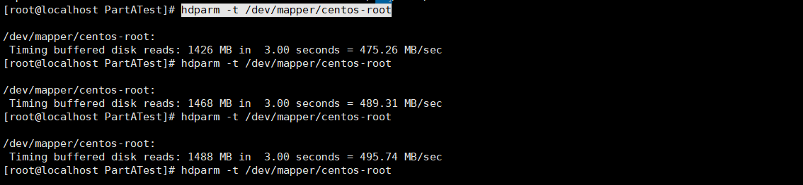
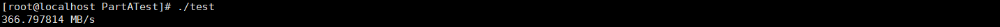
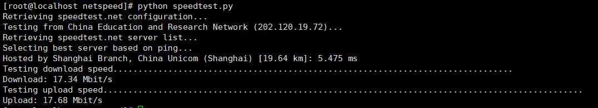

# PartA Experiment Report

## 1 测试环境

操作系统：Centos7 虚拟机

内存：4GB

处理器：2

硬盘：20GB

## 测试方法

### Storage

#### 1 hdparm指令

centos提供了hdparm指令进行磁盘读写测速

```bash
hdparm -t /dev/mapper/centos-root
```

#### 2 代码测试

```c
#include <stdio.h>
#include <stdlib.h>

int main()
{
    FILE *fp;
    double start, finish;  
    if((fp=fopen("test.txt","w"))==NULL)
    {
        printf("file cannot open \n");
    }
    start = clock();
    for (int i = 0;i < 10000000; i++){
        fputs("dajsdahbvn", fp);
    }
    finish = clock();
    printf( "%f MB/s\n", 100000000.0 / 1024 / 1024 / (finish - start) * CLOCKS_PER_SEC);
    if(fclose(fp)!=0)
        printf("file cannot be closed \n");
    else
        printf("file is now closed \n");
    return 0;
}
```

此程序打开一个文件，循环10000000次，每次往文件中写入10Bytes,计算耗费时间，从而得到IO读写的速度

### Network

采用网上提供的Python脚本speedtest-cli进行测试，测试指令如下

```bash
python speedtest.py
```

## 测试结果

### Storage

采用两种方法的测试结果如下：




可以看出程序测出来的速度小于指令测出来的读写速度，分析程序可知，循环所耗费的时间也会记录在读写文件的时间中，因此读写速度会偏小。

### Network

测试结果如下：


