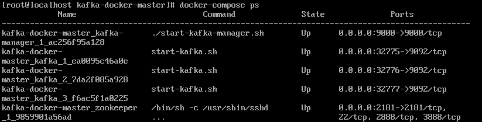
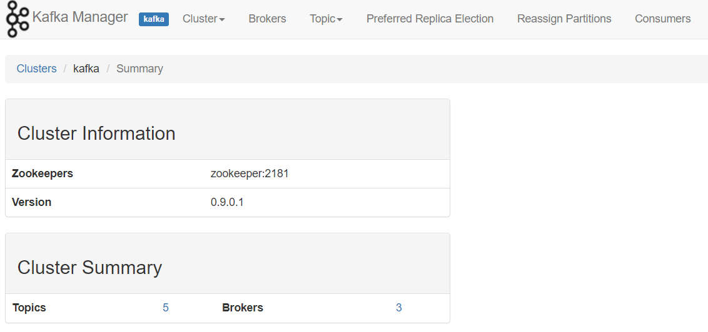
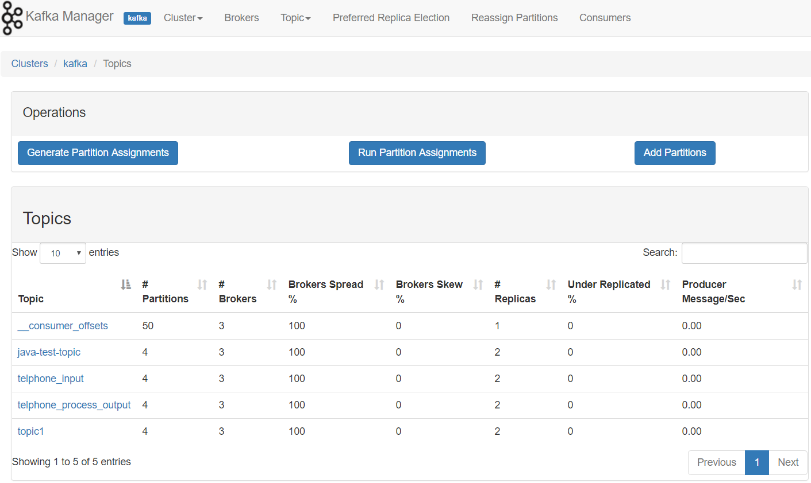

## [B part1] 搭建kafka集群

### 平台及工具

- OS: Centos 7
- Container: Docker (使用Docker compose编排)

### `docker-compose`文件

```yml
version: '2'
services:
  zookeeper:
    image: wurstmeister/zookeeper
    ports:
      - "2181:2181"
  kafka:
    build: .
    ports:
      - "9092"
    environment:
      KAFKA_ADVERTISED_HOST_NAME: 192.168.1.107
      KAFKA_ZOOKEEPER_CONNECT: zookeeper:2181
    volumes:
      - /var/run/docker.sock:/var/run/docker.sock
  kafka-manager:  
    image: sheepkiller/kafka-manager
    environment:
        ZK_HOSTS: 192.168.1.107
    ports:
      - "9000:9000"
```

服务介绍：

1. zookeeper

    负责协调集群内部一致性，对外部暴露2181端口

2. kafka

    每个kafka服务是一个broker，在每个容器内部使用9092端口，如果只有一个broker，则对外暴露9092端口；如果有多个容器，则随机暴露某些端口。

    在这里没有指定image，而是使用当前目录下的Dockerfile构建镜像。

3. kafka-manager

    kafka-manager是一个可视化监控和管理kafka集群的工具。

### 运行方法

启动集群
```bash
docker-compose up -d
```
设置broker数目为`N`
```bash
docker-compose scale kafka=N
```

### 结果展示

docker容器运行情况


监控界面


topic管理界面


### 参考文档

- [https://github.com/wurstmeister/kafka-docker](https://github.com/wurstmeister/kafka-docker)