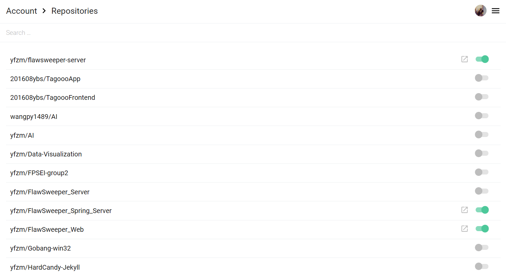
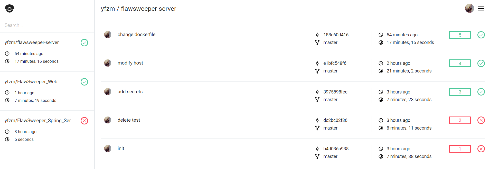
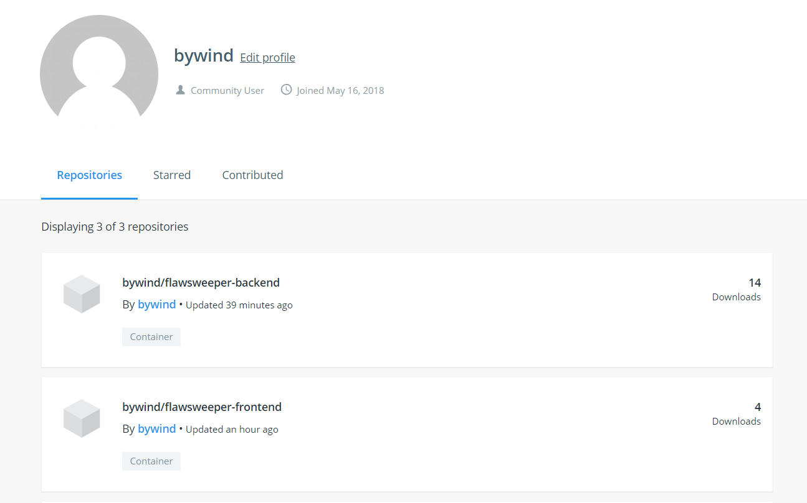

# CI/CD 环境搭建

使用drone作为CI/CD的工具，每次向github commit的时候会自动构建docker镜像，并push到指定的dockerhub。

## 准备CI/CD环境

1. 在Github的设置中创建OAuth Apps，填写将要部署的Drone的机器的信息，得到`Client ID` 和`Client Secret`。

2. 在云服务器上使用官方给出的`docker-compose`文件创建drone服务。

    ```ymal
    version: '2'

    services:
    drone-server:
        image: drone/drone:0.8

        ports:
        - 8088:8000
        - 9000
        volumes:
        - drone-server-data:/var/lib/drone/
        restart: always
        environment:
        - DRONE_OPEN=true
        - DRONE_HOST=http://118.25.17.127:8088
        - DRONE_GITHUB=true
        - DRONE_GITHUB_CLIENT=$CLIENT_ID
        - DRONE_GITHUB_SECRET=$CLIENT_SECRET
        - DRONE_SECRET=tryqtylwwzzxym

    drone-agent:
        image: drone/agent:0.8

        command: agent
        restart: always
        depends_on:
        - drone-server
        volumes:
        - /var/run/docker.sock:/var/run/docker.sock
        environment:
        - DRONE_SERVER=drone-server:9000
        - DRONE_SECRET=tryqtylwwzzxym

    volumes:
    drone-server-data:

    ```

3. 访问Drone的UI界面进行配置

    

    开启对将要部署的几个项目的追踪。

## 准备将要部署的项目

本次选用的项目是**错题本**，repo链接: [后端](https://github.com/yfzm/flawsweeper-server), [前端](https://github.com/yfzm/FlawSweeper_Web)

### 准备后端

后端是一个Spring Boot项目，编写Dockerfile如下

```dockerfile
FROM openjdk:8-jre
RUN mkdir /app
COPY ./target/flawsweeper-0.0.1-SNAPSHOT.jar /app/flawsweeper.jar
EXPOSE 8080
CMD java -jar /app/flawsweeper.jar
```

### 准备前端

前端是一个Vue写的项目，使用nginx作为基础镜像编写Dockerfile如下

```dockerfile
FROM nginx:latest
ADD ./dist /usr/share/nginx/html
COPY nginx.conf /etc/nginx/conf.d/default.conf
```

## 自动化部署

使用drone需要编写`.drone.ymal`文件：

### 后端：

```yml
workspace:
  base: /backend
  path: src/github.com/yfzm/FlawSweeper_Spring_Server

pipeline:
  build:
    image: maven:3.6.0-jdk-8-alpine
    commands:
      - mvn install
  publish:
    image: plugins/docker
    repo: bywind/flawsweeper-backend
    tags: ["latest"]
    secrets: [ docker_username, docker_password ]
    dockerfile: Dockerfile

```

这里的`docker_username`和`docker_password`可以在drone的UI界面里面配置。

### 前端：

```yml
workspace:
    base: /frontend
    path: src/github.com/yfzm/FlawSweeper_Web

pipeline:
    build:
        image: node:10.15.0
        commands:
        - npm install
        - npm run-script build
    publish:
        image: plugins/docker
        repo: bywind/flawsweeper-frontend
        tags: ["latest"]
        secrets: [ docker_username, docker_password ]
        dockerfile: Dockerfile
```

注意这里的node的版本指定为10.15.0，在实验中该版本过高会导致依赖错误。

## 结果展示



