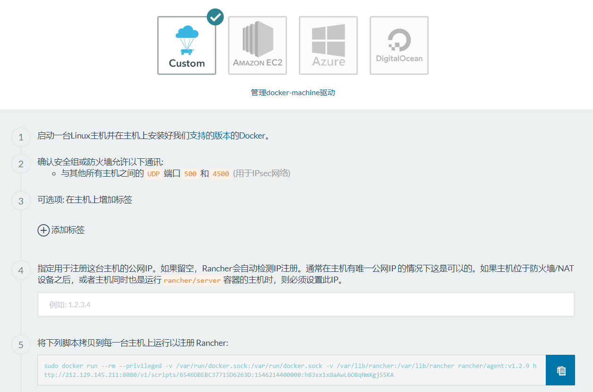

# 准备Kubernetes环境

使用腾讯云的服务器搭建k8s环境，服务器参数如下：

| 服务器 | 核心数 | Memory(GB) | OS |
| :---: | :---: | :---: | :---: |
| rancher-server | 2 | 8 | Ubuntu 16.04 LTS |
| node1 | 1 | 1 | Ubuntu 16.04 LTS |
| node2 | 1 | 1 | Ubuntu 16.04 LTS |
| node3 | 1 | 1 | Ubuntu 16.04 LTS |

Rancher原生支持k8s，而且可以指定相关镜像的地址，可以有效地避开google.com、gcr.io等地址。

## 版本信息

- Rancher-server: v1.6.11
- docker: ce-17.03.2 （其他版本Rancher不支持）
- kubernetes: v1.8.10

## 具体步骤

1. 在racher-server服务器上部署rancher server

    ```bash
    sudo docker run -d --restart always –name rancher-server -p 8080:8080 rancher/server: v1.6.11-rc3 && sudo docker logs -f rancher-server
    ```

2. 创建自定义k8s模板

    该步骤的主要目的是绕过GFW，将私有仓库地址设为registry.cn-shenzhen.aliyuncs.com, 将各个组件的命名空间设为`rancher_cn`

3. 使用自定义的模板创建集群

    

    将该页面展示的注册到Rancher的命令在rancher-server以及几个node节点上运行。

## 结果展示


