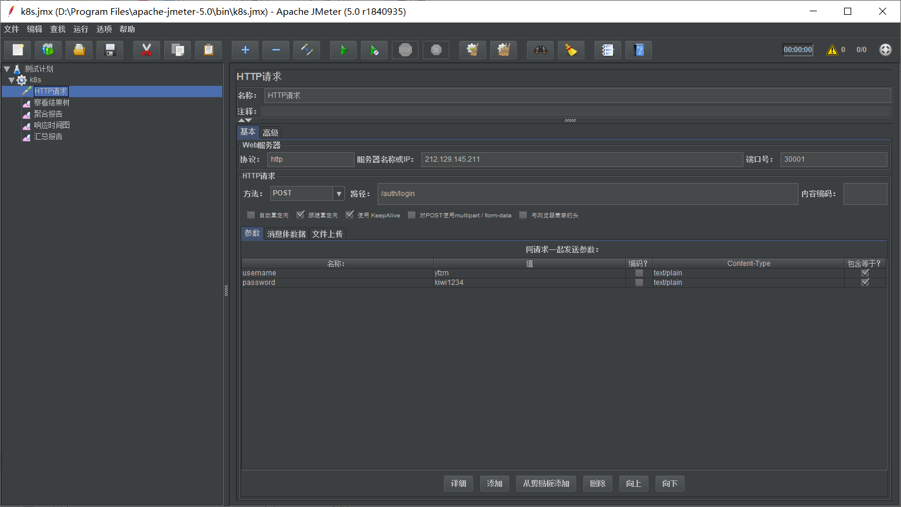
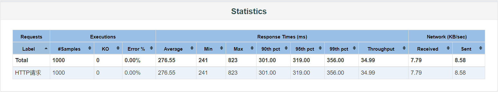
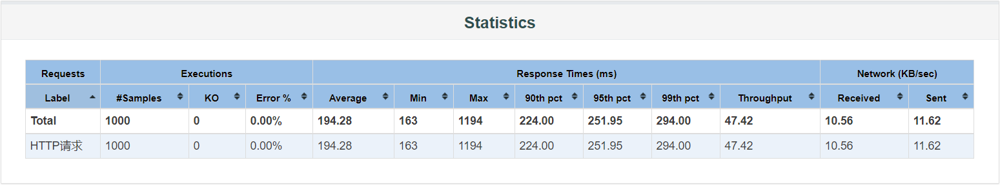
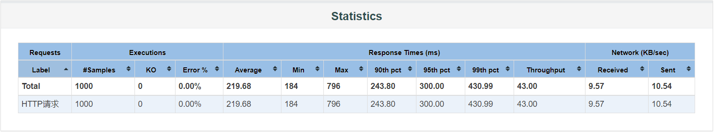

# 负载均衡

后端部署通过NodePort的方式暴露给外部，通过绑定主机的某个端口，进行pod的的请求转发，以实现负载均衡。

## 测试方式

在k8s仪表盘上手动修改副本控制器的所需容器组数量，如下图：


使用Jmeter进行压力测试，使用10个线程组，每组运行100次，以得到RPS，如下图：



分别在replica数目为1/2/3的时候运行以下命令：

```bash
./jmeter -n -t ./k8s.jmx -l resultx -e -o resultfolderx
```

## 测试结果

### replica=1



### replica=2



### replica=3



## 结果分析

由测试结果可以看出，副本数从1增到2时，throughput有较大的提升（35.8%），但是副本数再增加时，throughput不增反降。

这和几台机器的性能不同有着密切的关系。主机rancher-server为2核8G，其余的node节点均为1核1G。经记录，当只有1个容器组时后端的容器跑在rancher-server这台主机上，该节点满负荷运行。当增加一个容器组时，一定程度上分担了该节点的压力，但由于增加的节点的性能不够好，throughput并没有翻倍。当再增加一个node时，由于负载均衡是根据node节点来的，更多的请求被分配到了性能较差的普通node节点上，导致RPS并没有提高，反而还有所降低。